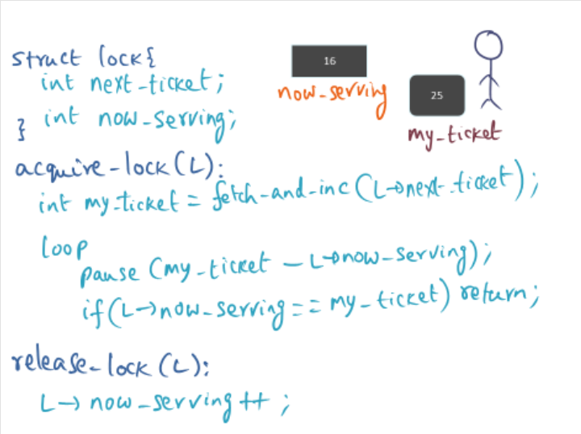

# -1. Helpful Resources

[Test Questions](https://docs.google.com/document/d/1Y4LsvVK9yQWaJaJwAlarXVf2W4kfDEPNKUwQ4nYXbRI/edit?usp=sharing)

[Practice Questions](https://docs.google.com/document/d/1oy_Xa8F4Ql4VTws-oVIISL1j1bQLTqmTt-Bs5ho2Ko0/edit?usp=sharing)

[Matt Chung's blog](https://blog.mattchung.me/category/computer-science/advanced-operating-systems/)

# 0. (1 point)

OMSCS program was launched in

---

2014

# 1. OS Structures (33 points)

Imagine you are at the SOSP session wherein all three papers SPIN, Exokernel, and L3 microkernel are presented. Your friend and you are comparing notes on what you got out of each paper in terms of intellectual contributions that advances the state of the art in OS structuring.

## 1.1 (3 points)

Your friend thinks SPIN has shown conclusively that an entire OS can be written in a high-level language that provides strong type safety. Would you agree with her point of view?

---

No.

SPIN was primarily written in the high-level language Modula-3, but portions of it was written in C.

## 1.2 (3 points)

Upon page fault service by a library OS, the mapping `<vpn, pfn>` has to be installed into the TLB by Exokernel on behalf of the library OS. Therefore, your friend thinks that Exokernel cannot provide good performance compared to a monolithic design of an OS. How would you counter her argument?

---

* Exokernel will be slower when writing to the TLB
  * Secure Bindings
    * Exokernels must create a secure binding when writing to the TLB
    * STLB can cache these bindings
    * Cost of creating the binding can be amortized over the lifetime of the TLB entry
    * Programs with a working set larger than the TLB will see a greater slowdown
* Exokernels can be faster in other situations as shown by Aegis and ExOS
  * Handling system calls and dispatching exceptions
  * Using IPC mechanisms like pipes and shared memory

---

## 1.3

L3 microkernel requires each subsystem to be in distinct architecture enforced protection domain. L3 is implemented on an architecture wherein there is no address-space tagging support in the TLB. The architecture does support segment registers.

### 1.3.a (3 points)

Your friend thinks that the performance is going to be terrible compared to SPIN due to the need for using architecture-enforced protection domains. What would be your counter argument?

---

* Segment registers allow L3 to implement protection domains in one address space. The segment registers will enforce protection.
  * Using one address space allows L3 to skip a TLB flush for small protection domains
* L3 is able to handle system calls much more efficiently
* Experimental evidence proved that L3 is significantly faster than SPIN in IPC

### 1.3.b (3 points)

Your friend thinks that L3’s approach to OS structuring would incur more implicit cost for protection domain switch compared to a monolithic design. Is she right or wrong? Defend your stand with justification.

---

Wrong.

* L3 will not be any less efficient due to implicit costs than a Monolith
* The implicit cost of switching protection domains comes from loss of cache locality in the CPU and TLB.
* There is no added implicit cost when switching protection domains in L3 because the TLB does not need to be flushed since the address space can be shared between protection domains.
* Large protection domains will require a TLB flush which increases implicit cost, but the same cost would be incurred for a monolith with subsystems that have large working sets.

## 1.a (3 points)

Give one example of how SPIN’s intellectual contribution can be traced to the state-of-the-art in modern systems.

---

SPIN helped prove the idea of dynamically loading code into the kernel, which can be seen today with device drivers. 

## 1.b (3 points)

Give one example of how Exokernel’s intellectual contribution can be traced to the state-of-the-art in modern systems.

---

Many of the techniques that Exokernel used can be seen in modern hypervisors. One instance of this is how Exokernel keeps track of execution time.

## 1.c (T/F + justification) (3 points)

SPIN and Exokernel are fair in comparing the superiority of their respective specialization approaches for OS services relative to Mach micro-kernel.

---

True.

* Both SPIN and Exokernel are saught to provide an alternative to the monolithic OS architecture.
* Mach placed value on portability which led to its poor performance
* L3 may have been a better comparison since it focuses more on performance than portability, which is the same approach that both SPIN and Exokernel took
* Exokernel provided another well performing alternative to microkernels

## 1.d (8 points)

__HIDDEN__

__TODO: prep for likely questions__

## 1.e (T/F + justification) (2 points)

SPIN is a microkernel

---

False.

* The SPIN paper describes itself as a microkernel, but we have define microkernel to mean a kernel in which OS systems run in their own address spaces.
* SPIN dynamically loads extensions into the kernel's address space.
* This difference is a large part of SPINs greater performance.

> Aside: The title of the SPIN paper is "SPIN – An Extensible Microkernel for Application-specific Operating System Services", so I'm not sure why our professor is classifying it as something else.

## 1.f (T/F + justification) (2 points)

Exokernel is a microkernel

---

False.

* Exokernel only provides primitives, whereas a traditional microkernel might provide abstractions like threads and virtual memory.
  * This makes Exokernels signicantly more simple that a microkernel.
* Exokernel allows dynamically uploading code into the kernel similar to SPIN.

# 2. Virtualization (Paravirtualization) (34 points)
 
You have implemented Xenolinux on top of Xen. You have implemented the network layer that does packet send/receive using two I/O rings: one for transmit and one for receive.

## 2.a (Paravirtualization) (4 points)

How will you ensure zero-copy semantics (i.e., no copying from your Xinolinux to Xen) for transmitting a packet?

---

With the transmisison IO ring:

1. Xenolinux will allocate a buffer that contains the data to be transmitted
1. Xenolinux forms a descriptor containing the address of the buffer
1. Xenolinux pins the pages containing the buffer so that Xen can access them during transmission
1. Xenolinux issues a hypercall to queue the request
1. Xen transmits the data by directly accessing the buffer
1. Xenolinux poll the ring for a response from Xen
1. When Xen responds, Xenolinux can unpin the page

## 2.b (Paravirtualization) (4 points)

How will you ensure zero-copy semantics for receiving a packet from Xen into Xinolinux?

---

1. Xenolinux pre-allocates buffers to hold incoming packets
1. Xenolinux provides the locations of the buffers to Xen
1. Xenolinux pins the buffers so that Xen can access them
1. Xen directly copies data into a buffer provided by Xenolinux
1. Xen enqueues a descriptor to let Xenolinux know about the data in the buffer
1. Xenolinux handles the enqueued descriptor and is able to directly access the data

## 2.c (Paravirtualization) (4 points)

Multiple processes on top of Xenolinux wish to transmit at the same time. How do you handle this situation in your implementation?

---

* Applications will cause the usual APIs which cause Xenolinux to transmit in the manner described above
* Transmission for multiple processes on Xenolinux works identically to transmission for one process. Xenolinux will allocate a buffer, fill it with data, and put it in the IO ring to be processed by Xen.
* Xenolinux has exclusive write access to the request pointer, so it can schedule outgoing requests using whatever algorithm it pleases

Xen will use a round-robin algorithm to transmit packets acrosss multiple VMs to ensure fairness.

## 2.d (Full virtualization) (8 points)

Assume a guest-OS has started 4 processes in a fully virtualized environment on a 32-bit machine. Assuming 4K page size, explain how many entries this guest-OS has in the shadow page table.

---

4K page size means 12 bits for the offset, and (32 - 12) = 20 bits for the index

Answer is 2^20 * 5, because there are four processes plus the OS.

## 2.e (Full virtualization) (4 points)

Assume an architecture which uses a page table for address translation. The CPU has a PTBR to point to the current page table used by the processor for address translation.

A process P1 is executing on top of a fully virtualized OS. The OS wishes to context switch from P1 to P2.

List the steps before P2 starts execution on the processor.

---

The hypervisor will use a trap-and-emuate strategy.

1. The guest OS will execute a privileged instruction to update the page table base register (PTBR) to the new process page table. This will cause a TRAP that the hypervisor then handles
1. The hypervisor will use the shadow page table for the guest to convert the PPN of the PTBR to the MPN
1. The hypervisor sets the PTBR to the MPN
1. The guest performs the normal steps for a context switch, such as saving and restoring registers
1. Execution of P2 can now begin

## 2.f (10 points)

__HIDDEN__

__TODO: prep for likely questions__

# 3. Parallel Systems (32 points)

## 3.a (atomicity) (4 points)

You are implementing an invalidation-based cache coherent shared memory multiprocessor, wherein each processor has a private cache. You start with a uniprocessor as a basic building block. The ISA of the processor supports an atomic Test-and-Set (T&S) instruction. Your aim is to make sure that the T&S operation is globally atomic. What design choices are available to you to achieve this aim?

---

* Execute the read-modify-write in the cache controller using invalidation based cache coherence.
* Give exclusive ownership of the bus to the processor
* Execute the read-modify-write in the memory controller. The memory controller will serialize operations to the same memory locations.

## 3.b (memory model) (4 points)

Your co-worker wants to provide a sequential consistency memory model to the application programmer on top of your multiprocessor. How can you take care of her requirement in your cache coherent multiprocessor design?

---

* Sequential consistency can be achieve with cache coherence protocols
* For example, with an invalidate based coherence, all other copies of the cache will be invalidated before the write, which can then be fetch after the write.


## 3.c (spinlock) (4 points)

Consider the following lock algorithm using T&S:

```C
while ((L == locked) or (T&S(L) == locked)) {
  while (L == locked); // spin
  delay (d[Pi]); // different delays for different processors
}
// success if we are here
```

### 3.c.1 (T/F + justification) (No credit without justification) (2 points?)

This algorithm does not rely on hardware cache coherence.

---

False. The algorithm spins on the cached variable L.

### 3.c.2 (T/F + justification) (No credit without justification) (2 points?)

The algorithm performs especially well under high lock contention.

---

True. The use of the cache reduces resource contention, and the delay further helps reduce contention.

## 3.d (spinlock) (4 points)

The ticket lock algorithm shown below gives fairness and each spinning processor spins for a different amount of time commensurate with its expected wait time for the lock before testing if the lock is available.



What (if any) are the reasons for this algorithm to not work well?

---

* The value of the pause duration is important. If it is too low, you'll cause unnecessary contention. If it is too high, you'll be waiting when you could be working.
* Setting the value of the pause requires more knowledge about the performance characteristics of your program and hardware than other general purpose locks

## 3.e (barrier) (T/F + justification) (No credit without justification) (6 points)

### 3.e.1 (2 points?)

MCS barrier will not work on a NCC-NUMA architecture.

---

False.

* Memory locations of variables to spin on are statically determined, so these can be cached in the local memory of each processor
* Wake-up occurs using explicit signaling directly to the processor being woken up, so cache coherence is not required.

### 3.e.2 (2 points?)

The total communication complexity of dissemination barrier is O(N\*Log2N)

---

True.

Dissemination barrier requires ceiling(log(2, n)) rounds, with each round requiring n messages, so the complexity is n * ceiling(log(2, n))

### 3.e.3 (2 points?)

The tournament barrier works with both shared memory and message-passing (i.e., clusters) architectures.

---

True.

* The algorithm relies on a statically determined winner and statically determined memory locations.
* This allows the algorithm to have the winners directly notify the losers once the barrier is complete
* Message-passing architectures are supported because the losers know who will be notifying them to continue.

## 3.f (2 points)

__HIDDEN__

__TODO: prep for likely questions__

## 3.g (scheduling) (4 points)

A multi-threaded multicore CPU is one in which each chip has multiple cores and each core has multiple hardware threads. The OS chooses the set of application threads to be scheduled on the hardware threads in each core. Given that the hardware threads share a single processor pipeline on the core,

### 3.g.1

What purpose is served by the hardware threads?

---

Hardware threads allow better utilization of a physical CPU. When a thread is blocked, for example due to a page fault, the CPU can switch to another thread while waiting for the page fault to be handled.

### 3.g.2

What should the OS do ensure that processor pipeline is utilized well? Why?

---

The OS should arrange threads so that they can efficiently exploit the CPU cache. Ideally this means that the working set of all threads executing on the CPU fit into the last level of CPU cache. The CPU should also schedule threads to run so that they can efficiently exploit the cache.

## 3.h (memory manager for multiprocessor) (4 points)

You are implementing the virtual memory manager for your multiprocessor OS.

You have a page fault handler that executes independently in each processor. If there is a page fault for the currently executing thread/process, then the handler on that processor deals with it without disturbing the activities on the other processors. Your OS supports both single-threaded processes as well as multi-threaded processes. You implement your memory management system in the conventional manner with a page table per process that provides the mapping of the VPN to PPN (or the disk address if it is not in physical memory).

### 3.h.1 (2 points?)

Does your design ensure that if there are concurrent page faults incurred by independent processes running on different processors, they will be handled by your memory manager concurrently? Justify your answer.

---

Yes.

Since we have a page table per process, the page table needed to cater to different page faults would be different.

### 3.h.2 (2 points?)

Does your design ensure that if there are concurrent page faults incurred by threads of the same process running on different processors, they will be handled by your memory manager concurrently? Justify your answer.

---

No.

Since the mappings from VPN to PPN for different threads of the same process will be present in the same page table, the memory manager would need to serialize the handling of these page faults
